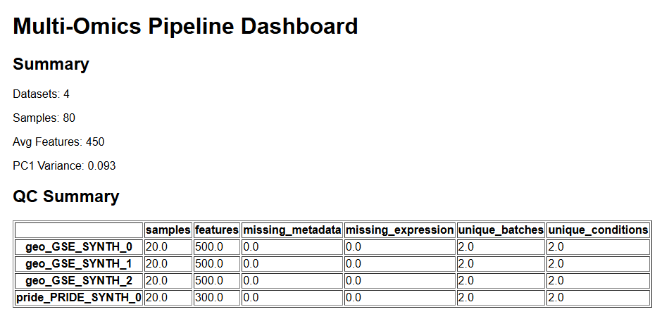
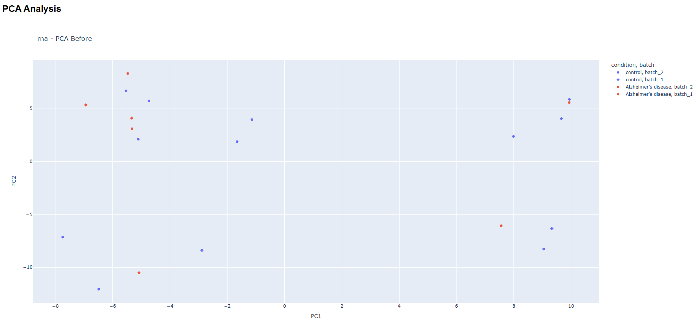
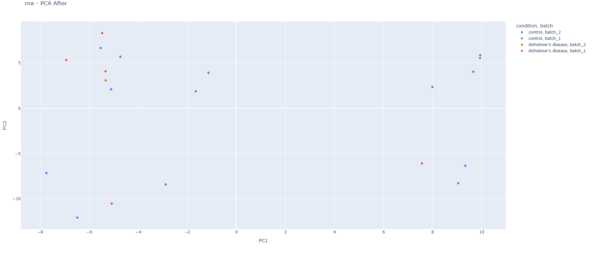

# Multiomics data pipeline for cross study integration and feature selection
AI usage disclosure
    This project utilized AI tools for:
        - Debuggging code (pipeline error, alignment issues, PCA bugs)
        - architechtural design brainstorming (medallion design, batch correction)
        -improving code structure and robustness

    Not Used for:
        - Direct copy paste of full soutions
        - Writing final report content without modififcation
All implementation, validation and final integration were performed by the auhtor

#Team
Name: Keerthanaa Balasubramanian Shanthi
Contribution:
    - Pipeline design and implementation
    -multiomics integration
    - ML modeling
    - Testing and debugging

# Tasks implemented

# Documents and Presentation
    - Pipeline architecutre description
    - data schema documentation
    - end to end workflow explanation
    - code linked explanations
    - clear structure and readability
    - Innovative multiomics integration
    - dashboard for results

# Data Ingestion
    - Structed data( now works with synthetic data)
    - semi-structed data parsing (gene count files)
    - Automated batch injestion pipeline

# Data Processing and cleaning
    - ETL pipeline(cleaning, normalization, transformation)
    - medallion architecture
    - metadata harmonization(ontology +fuzzy matching)
    - Feature ID harmonization (Ensembl/Uniprot)
    - missing value imputation (proteomics)
    -schema validation

# Advanced features
    - Data lieage tracking 
    - ML model (Random Forest feature selection)
    - Batch effect detection(PCA, PVCA)
    - Batch correction (ComBat) condiitonal only batch effect is found

# Visualization and Monitoring
    - HTML dashboard 
    - PCA (before and after batch correction)
    - pipeline statistics tracking
    - QC reports

# Data Sharing
    - Dashboards can be shared as data product along with gold layer
    - structred  outputs

# Data product
    - Defined data schema (metadata + expression) 
    - API- ready structure
    - Validation and testing hooks
    - can be deployed in cloud platforms like databricks with minimal chages retaining the architecture

# Logging
    - Structured logging across all stages
    - Error handling and fallbacks

# Project Overview
This project implemets a config driven multi-omics pipeline that integrates RNA-seq and proteomics datasets from multiple repositories (GEO and PRIDE)

The pipeline is designed for:
    - resuability
    - scalability
    - biological validity

It performs:
    - Data ingestion
    - Harmonization
    - Normalization
    - Batch effect detection and correction
    - Feature selection using machine learning

# Pipeline Architecture
data/
│
├── bronze/      ← raw ingested data
├── gold/        ← final analytics-ready data

# Pipeline Flow
Ingestion
   ↓
Metadata Harmonization
   ↓
Normalization (config-driven)
   ↓
Feature Harmonization (Gene/Protein IDs)
   ↓
Missing Value Imputation for proteomics
   ↓
Split by Omics (RNA / Proteomics)
   ↓
Feature Alignment
   ↓
Batch Effect Detection (PCA, PVCA)
   ↓
ComBat Correction (if needed)
   ↓
Machine Learning (Random Forest)
   ↓
Gold Export + QC + Stats

# Data Sources
1. GEO (RNA seq)
    - Gene expresison counts
    - Multiple studies combined
    - Ensembl gene IDs

2. PRIDE (Proteomics)
    - Protein abundance data
    - Missing values handled
    - Uniprot IDs

3. Synthetic Dataset
    - Generated to validate:
        - Batch effects
        - Biological signal
        - ML feature recovery

# data schema
Metadata
Column              Description
sample_id           Unique sample
condition           Biological condition
batch               tehcnical batch
study_id            study source
repository          GEO/PRIDE
omics               RNA/Proteomics

# Expression Matrix
Row                 Column
Sample              Feature (gene/protein)

# Key Features

1. Config driven normalization
    supports
        - DESeq2(VST, rlog)
        - TPM/FPKM
        - Quantile
        - z-score
        - median normalization

2. Meta data harmonization
        - synonym mapping
        - Fuzzy mapping
        - Schema enforcement

3. Feature ID harmonization
    - Ensembl conversion to gene symbols using BioMart
    - Uniprot normalization
    - this ensures cross study compatability for feature selection

4. Batch effect handling
    Detection
        -PCA
        -PVCA
    Correction
        - ComBat(applied only if atch effect detected)

5. Machine learning
    - random forest classifier
    - feature importance extraction
    - per omics analysis

6. PCA analysis
    - before and after batch correction
    - Used ot validate:
        - Batch removal
        - biological clustering

# Quality control
Computed metriics:
    - Missing value rate
    - Sample count
    - Feature count
    - PCA variance explained

# How to Run
#activate environment
venv\Scripts\activate
#run pipeline
python src/run_pipeline.py

# Repository Structure
README.md
requirements.txt
LICENSE
config/
dashboard/
Data/
logs/
src/
venv/

# Innovativeness
- Multiomics data integration (intiated)
- Automated metadata harmonization
- COnfig driven achitecture
- Automated batch detection and correction
- ML integrated into ETL pipeline
- synthetic validation framework

# Limitations
- The real world omics data needs standardization before this pipeline which will take rigorous robust standardization before ingestion
- BioMart dependency may fail (fallback implemented)
- Synthetic data used for testing (not full biological complexity)
- No real-time streaming (batch-based pipeline)

# Future improvements being done
- Real-time ingestion (streaming)
- Deep learning models
- Cross-omics integration (joint embedding)
- Web dashboard / API deployment

# Conclusion
This pipeline demonstrates a fully automated, reusable and iologically meaningful data engineering solution for multi-omics data analysis and intergation:
- Data engineering
- Bioinformatics
- Machine Leanring

